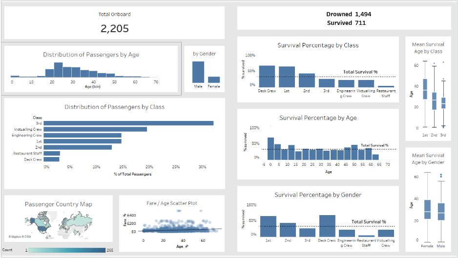

The dataset contains information about the passengers aboard the Titanic. This historical dataset provides details on various aspects such as gender, age, passenger class, and survival status. The primary goal is to gain insights into the demographics of the passengers, their distribution across different classes, and the survival rates within these categories.
I created various visulizations in tableau with a dashboard to dispay it all. 

Left side is overall demographics on board.
Right side demographics of survivors.
You can filter on survived/drowned and see how that affects the overall demographics.  
  
Tableau link https://public.tableau.com/app/profile/ruchel.weissman/viz/TitanicData_17108845829940/DistributionofPassengersbyGender

